此教程简单明了介绍了自建cf节点方法，节点_worker.js来自cmliu的cmliu/edgetunnel项目

1、先访问[cloudflare](https://dash.cloudflare.com/login)，用邮箱注册一个账号，并在邮箱点击验证链接

2、邮箱点击验证链接之后，如下图操作

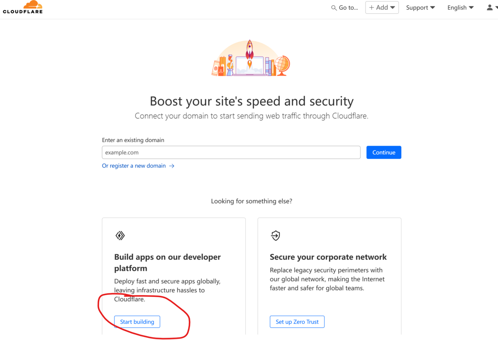
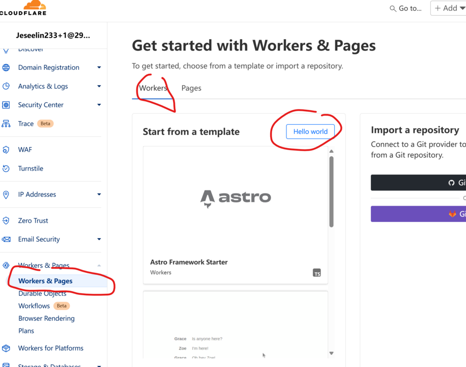

直接点击Deploy

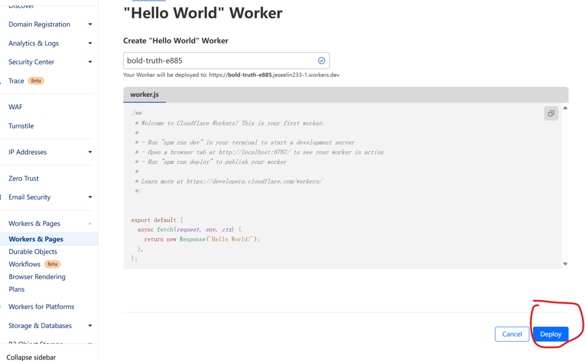

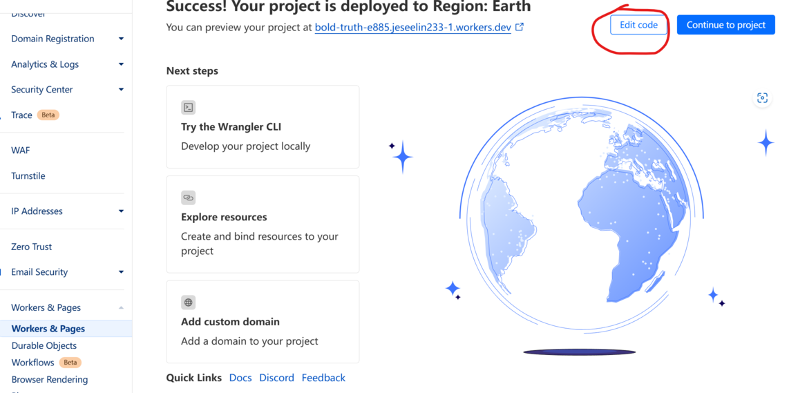

之后将这个文件的内容复制粘贴进代码输入框
https://github.com/jesee/cfvpn/blob/master/worker/_worker.js

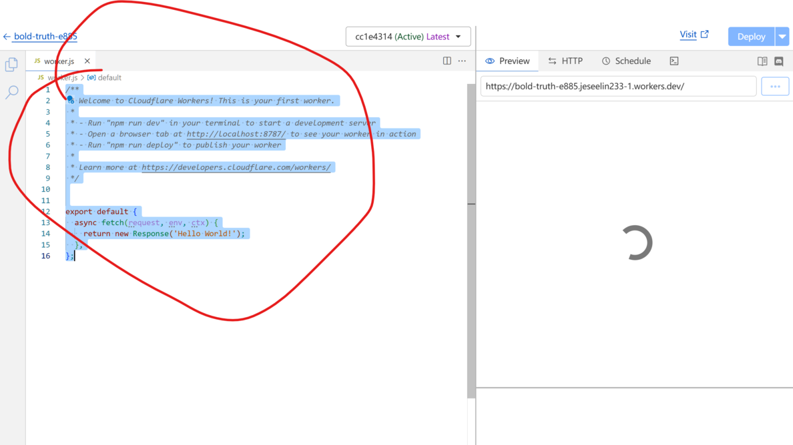

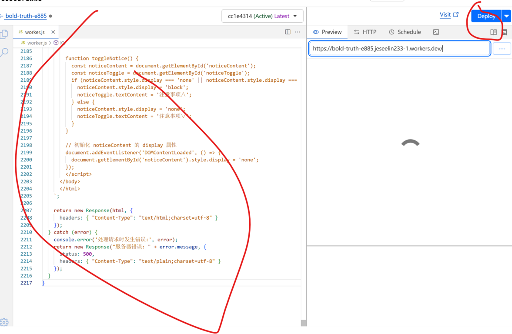

Deploy之后点击上图左上角的返回，定位到下图的菜单

将UUID值粘贴进去：bc24baea-3e5c-4107-a231-416cf00504fe

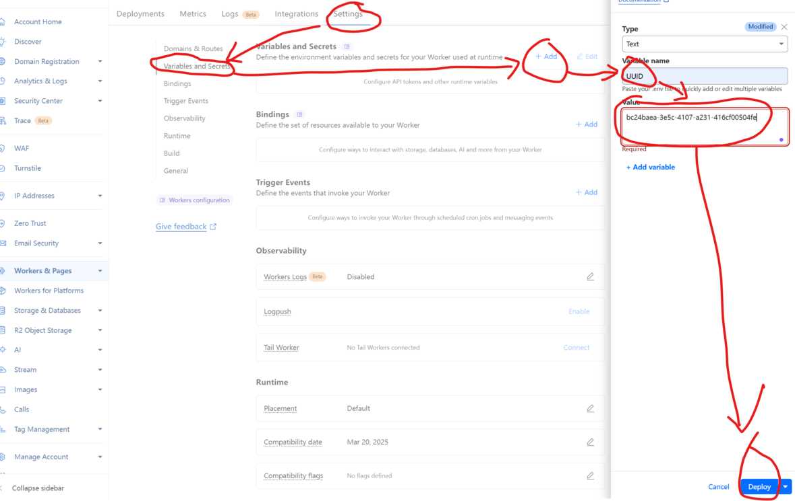

Deploy之后再定位到下图的菜单

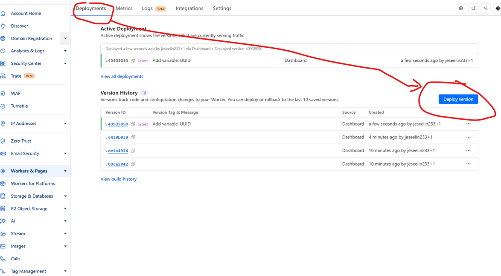

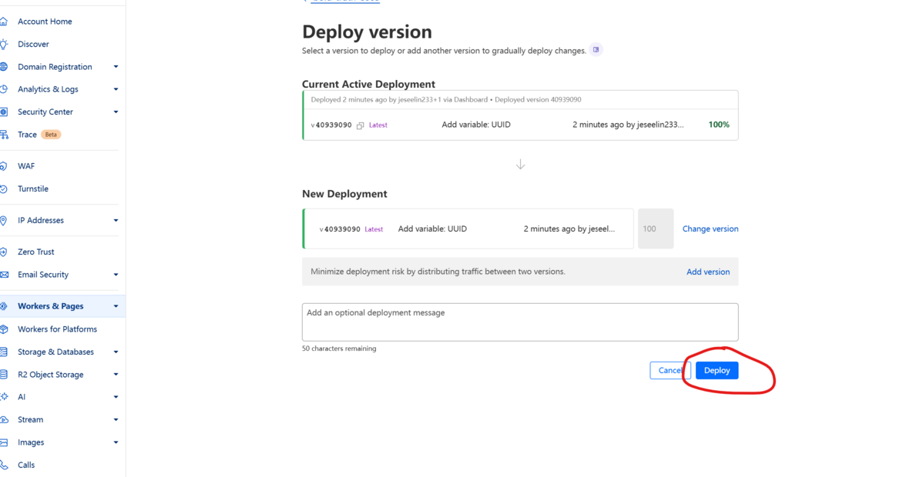

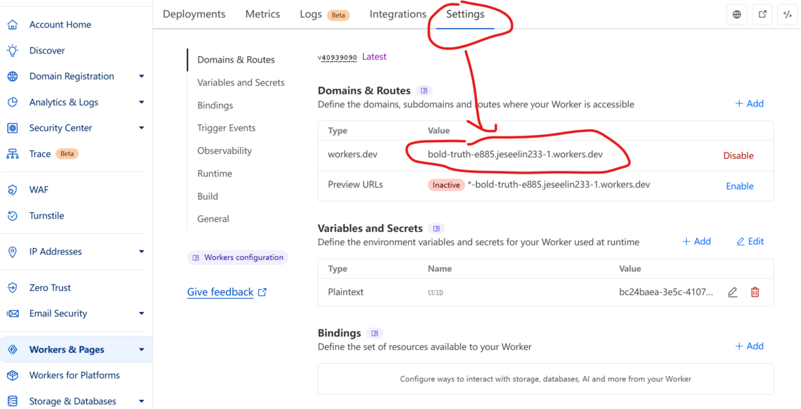

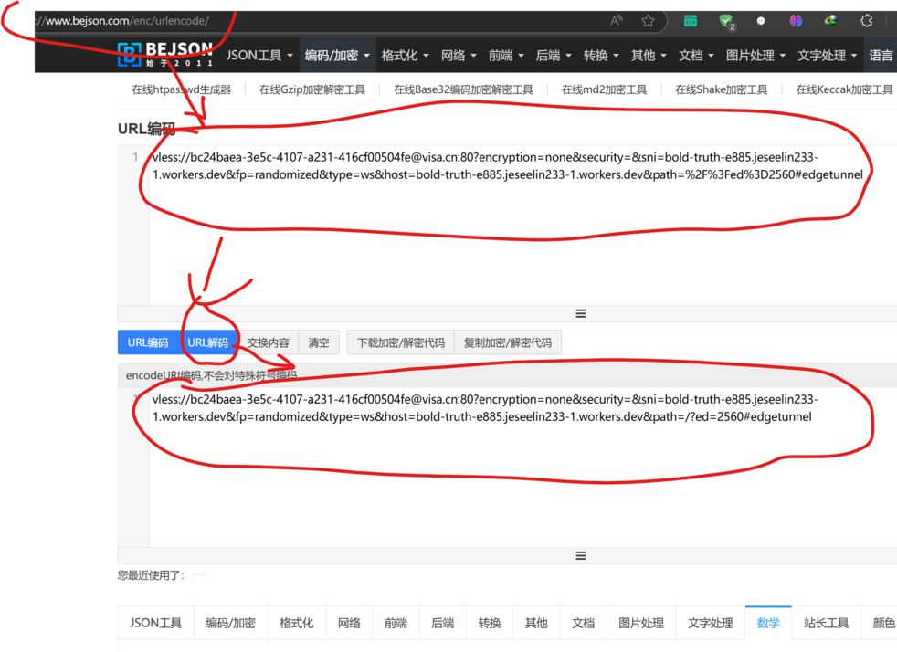

最后复制这个解压缩后的内容到软件目录下的vless.conf文件中就行了，此文件一行一条内容，不要多行混为一行
