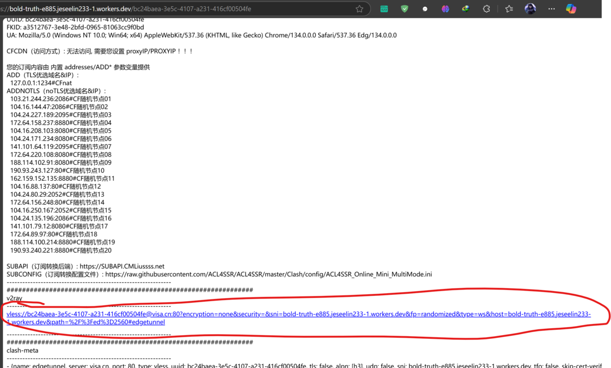
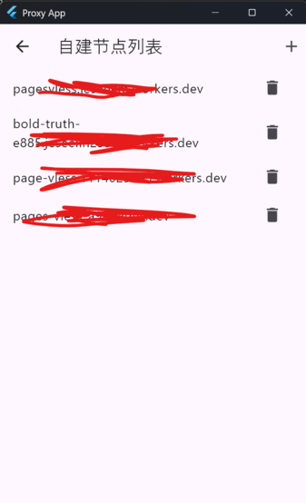

此教程简单明了介绍了自建cf节点方法，节点_worker.js来自cmliu的cmliu/edgetunnel项目

1、先访问[cloudflare](https://dash.cloudflare.com/login)，用邮箱注册一个账号，并在邮箱点击验证链接

2、邮箱点击验证链接之后，如下图操作

直接点击Deploy

之后将这个文件的内容复制粘贴进代码输入框
https://github.com/jesee/cfvpn/blob/master/worker/_worker.js

Deploy之后点击上图左上角的返回，定位到下图的菜单

将UUID值粘贴进去：bc24baea-3e5c-4107-a231-416cf00504fe

Deploy之后再定位到下图的菜单

再Deploy之后定位到下图菜单，并复制途中域名bold-truth-e885.jeseelin233-1.workers.dev

将UUID拼接到地址后面并访问如：https://bold-truth-e885.jeseelin233-1.workers.dev/bc24baea-3e5c-4107-a231-416cf00504fe

复制图中地址到[url解压缩工具](https://www.bejson.com/enc/urlencode/)解压缩一下

最后复制这个解压缩后的内容到软件设置下自建节点设置页面进行添加

